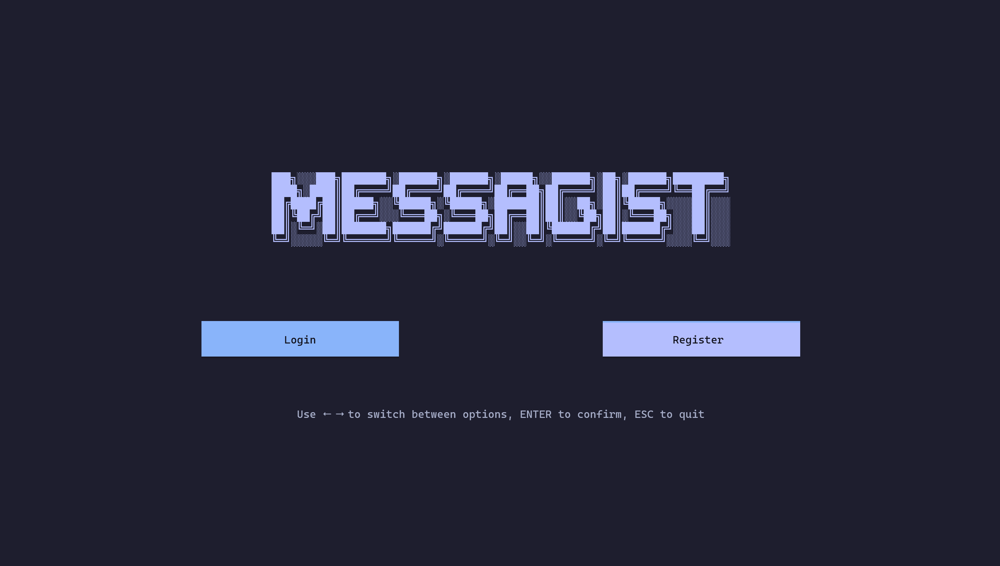
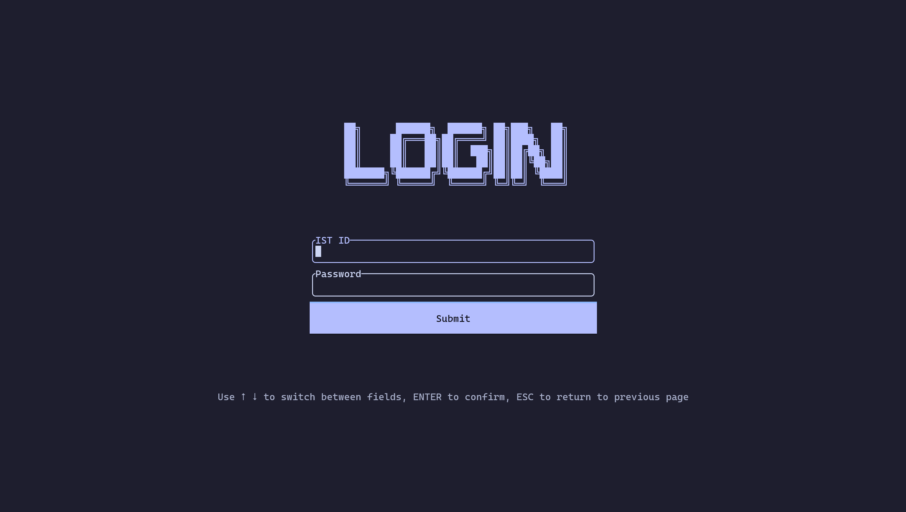
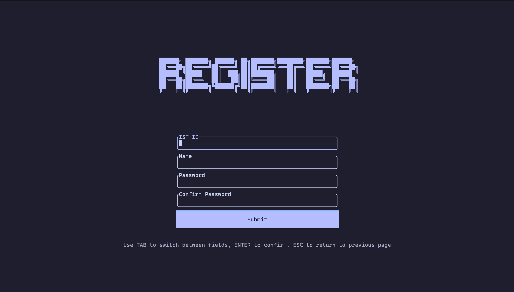
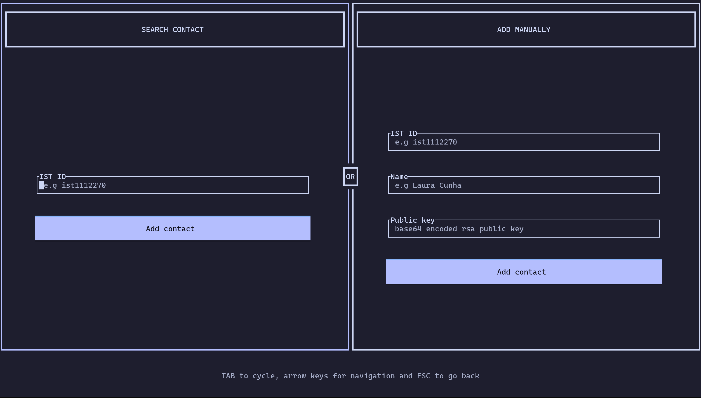
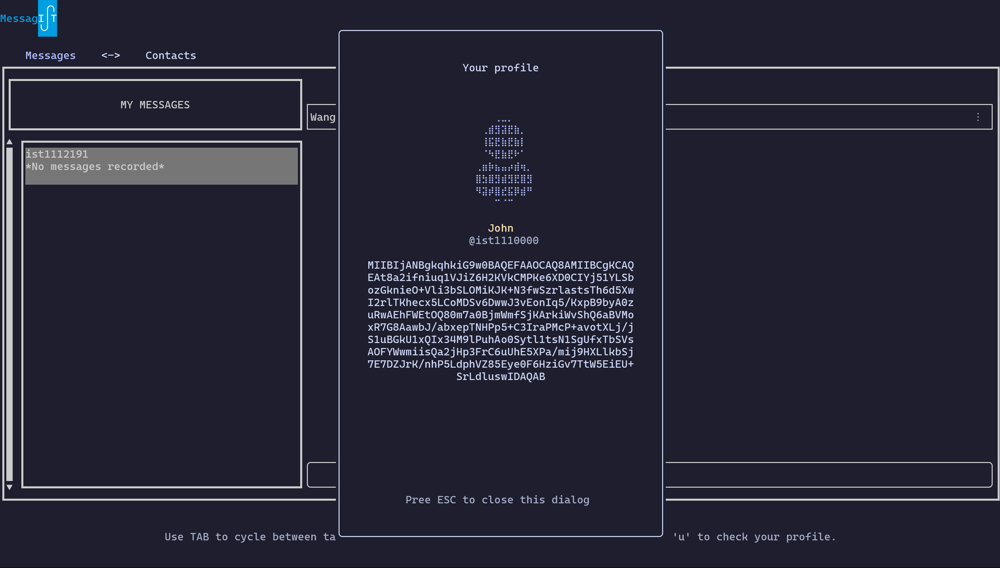
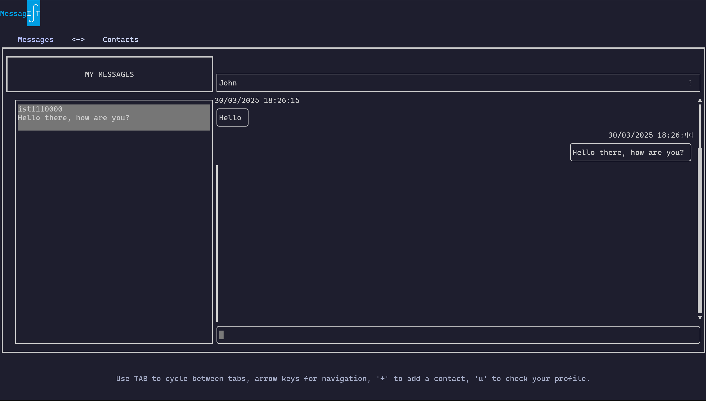
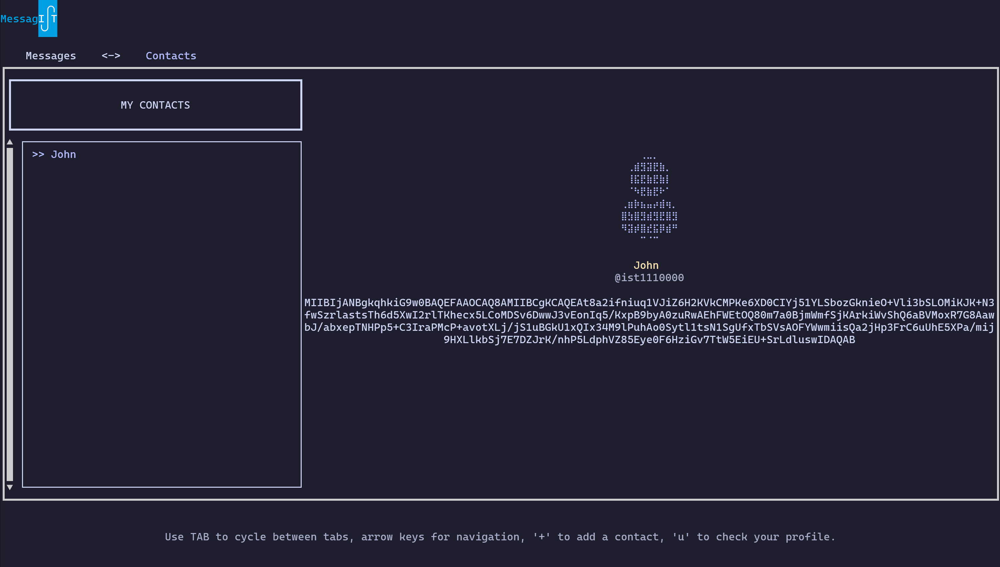

# MessagIST

MessagIST is an end-to-end encrypted message app built for the IST community. Developed within the course of *Network and Computer Security (SIRS)*.

<p align="center">
    
</p>

## Key Features

- **End-to-End Encryption:** Messages are encrypted using state-of-the-art cryptographic algorithms.

- **Exceptional Speed:** MessagIST is implemented in Rust, a language known for its efficiency and safety.

- **TUI:** Mouse free terminal text-based user interface, implemented using [Ratatui](https://github.com/ratatui/ratatui).

## Contents

-   [Setting up](#setting-up)
-   [Deployment](#deployment)
-   [Acknowledgements](#acknowledgements)
-   [Screenshots](#screenshots)
-   [Feedback](#feedback)
-   [License](#license)

## Setting up

### Prerequisites

- [Rust and Cargo](https://www.rust-lang.org/tools/install) 
  
- [Postgres 17](https://www.postgresql.org/download/)

- [Docker](https://docs.docker.com/engine/install/) (Optional for deployment)

### Steps

1. Clone the repository
    ```sh
    git clone https://github.com/OperandOverflow/messagist.git
    cd messagist
    ```

2. Build project
    ```sh
    rustup default stable
    cargo build
    ```

3. Configure database
    ##### Linux
    (Under construction)

    ##### Windows
    (Under construction)

## Deployment
(Under construction)


## Screenshots

Below are some screenshots of the application in action:

### Menu page

<p align="center">
    
</p>

<details> 
    <summary>More images</summary>
    <ul style="list-style:none">
        <li>
            <h3>Login</h3>
            <p align="center">
                
            </p>
        </li>
        <li>
            <h3>Register</h3>
            <p align="center">
                
            </p>
        </li>
        <li>
            <h3>Add contact</h3>
            <p align="center">
                
            </p>
        </li>
        <li>
            <h3>User profile</h3>
            <p align="center">
                
            </p>
        </li>
        <li>
            <h3>Chat</h3>
            <p align="center">
                
            </p>
        </li>
        <li>
            <h3>Contacts</h3>
            <p align="center">
                
            </p>
        </li>
</details>

## Acknowledgements

A big thanks to the co-authors [@mkuritsu](https://github.com/mkuritsu/) and [@Kuuki](https://github.com/kuukitenshi), without them this project would not be possible, please also check out their pages for more interesing projects.

## Feedback

For any questions or feedback, please feel free to reach out to me at wangxiting01917@gmail.com.

## License

This project is licensed under the MIT License - see the [LICENSE](LICENSE) file for details.